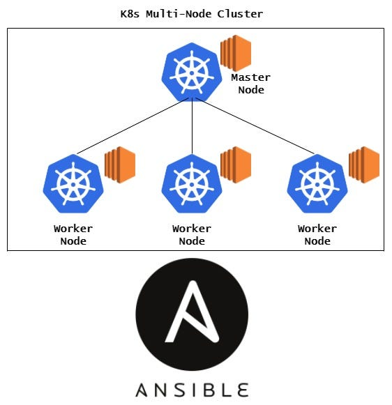

# Kubernetes Multi-Node Cluster Setup (Ansible + kubeadm)



This repository contains Ansible playbooks to provision a **production-ready Kubernetes cluster** using **kubeadm**, **CRI-O**, and **Calico**, aligned with the **latest stable Kubernetes version (v1.30)**.

The setup is **idempotent**, meaning the playbooks can be safely re-applied without breaking an existing cluster.

---

## Features

* Kubernetes **v1.30** (official packages)
* **CRI-O** as the container runtime (version-matched with Kubernetes)
* **Calico** CNI (official manifest)

---

## 📁 Repository Structure

```
.
├── k8s_common.yaml       # Common setup for all nodes
├── k8s_master.yaml       # Control plane initialization
├── k8s_workers.yaml      # Worker node join logic
├── join-command.sh       # Auto-generated join command (created at runtime)
└── README.md
└── create_instance.yml  # Provision three ec2 instances of t2.medium
└── instance_vars.yml & aws_credential.yml #Variables & Credentials (User ansible-vault for managing credential)
└── inventory.j2          # Jina template for dynamic inventory file creation
```

---

## Prerequisites

### System Requirements

* Swap **disabled**
* Ports open:

  * `6443` (Kubernetes API)
  * `10250` (kubelet)
  * Calico networking ports

### Tools

* Ansible installed on the control machine
* SSH access to all nodes

---

## Kubernetes Versioning

| Component  | Version        |
| ---------- | -------------- |
| Kubernetes | v1.30          |
| CRI-O      | v1.30          |
| CNI        | Calico v3.27.x |

All components are installed from **official repositories**.

---

## Installation Steps

### 1️⃣ Provision Ec2 instances

Run `ansible-vault create aws_credential.yml` and add your credentials
Modify the variables in `instance_vars.yml` as per your setup
create `key.pem` with your private key
Run `ansible-playbook create_instance.yml --ask-vault-pass` to create ec2 instances

Ensure your Ansible inventory defines the groups correctly:

```ini
[k8s-master]
master-node-ip

[k8s-workers]
worker-node-1-ip
worker-node-2-ip
```

---

### 2️⃣ Run K8s Common Setup (All Nodes)

```bash
ansible-playbook k8s_common.yaml
```

This step:

* Disables swap
* Loads kernel modules
* Configures sysctl
* Installs Kubernetes and CRI-O
* Starts required services

---

### 3️⃣ Initialize the Master Node

```bash
ansible-playbook k8s_master.yaml
```

This step:

* Initializes the Kubernetes control plane using `kubeadm`
* Configures kubectl access
* Installs Calico CNI
* Generates the worker join command

---

### 4️⃣ Join Worker Nodes

```bash
ansible-playbook k8s_workers.yaml
```

This step:

* Safely joins worker nodes to the cluster
* Skips nodes that are already joined
* Prevents failures on re-apply

---

## 🌐 Networking

* Pod CIDR: `192.168.0.0/16`
* CNI: **Calico** (official manifest)
* Supports:

  * Pod-to-pod communication
  * Service networking
  * NetworkPolicies

---

## Validation

After installation, verify the cluster (First do ssh to master node and then perform the below commands):

```bash
kubectl get nodes
kubectl get pods -n kube-system
kubectl get ds calico-node -n kube-system
```

All nodes should be in **Ready** state and all system pods should be **Running**.

---

# rhel_Common.yaml – Playbook Explanation

`rhel_Common.yaml` performs **common system-level configuration** on **all Kubernetes nodes** (master and workers) before cluster initialization.

Its responsibilities include:

* Preparing the OS kernel for container networking
* Installing Kubernetes and CRI-O from official repositories
* Ensuring required services are enabled and running

---

## Scope

* Runs on: **All nodes** (`hosts: all`)
* Privilege escalation: **Enabled** (`become: true`)
* Target OS family: **RHEL-based Linux distributions**

---

## Variables Used

| Variable             | Description                                       |
| -------------------- | ------------------------------------------------- |
| `kubernetes_version` | Kubernetes major/minor version to install (v1.30) |
| `pod_cidr`           | Pod network CIDR (used later during cluster init) |
| `packages`           | Base OS utilities required by Kubernetes          |

---

## Task-by-Task Explanation

### 1️⃣ Disable Swap (Runtime)

```yaml
- name: Disable swap
  command: swapoff -a
```

* Kubernetes **requires swap to be disabled**.
* This command disables swap immediately on the running system.

---

### 2️⃣ Disable Swap on Reboot (Persistent)

```yaml
- name: Add swapoff to crontab for reboot
```

* Ensures swap remains disabled **after system reboot**.
* Uses a cron job triggered at boot time.
* Prevents kubelet startup failures after reboot.

---

### 3️⃣ Install Required Base Packages

```yaml
- name: Install required packages
```

Installs basic utilities needed for Kubernetes and debugging:

* `iproute-tc` → Required for traffic control and CNI plugins
* `git` → Useful for fetching manifests and repositories
* `curl` → Required for downloading repo keys and files

---

### 4️⃣ Load Required Kernel Modules (Runtime)

```yaml
- name: Load kernel modules
```

Loads critical kernel modules:

* `overlay` → Required by container runtimes
* `br_netfilter` → Enables bridged network traffic to pass through iptables

These are mandatory for Kubernetes networking.

---

### 5️⃣ Persist Kernel Modules Across Reboots

```yaml
- name: Persist kernel modules
```

* Ensures required kernel modules are automatically loaded on boot.
* Prevents networking issues after system restarts.

---

### 6️⃣ Apply Kernel Networking Parameters (sysctl)

```yaml
- name: Apply sysctl params
```

Configures kernel parameters required for Kubernetes:

* `net.bridge.bridge-nf-call-iptables = 1`
* `net.bridge.bridge-nf-call-ip6tables = 1`
* `net.ipv4.ip_forward = 1`

These settings allow:

* Pod-to-pod communication
* Service networking
* Proper iptables rule processing

---

### 7️⃣ Reload sysctl Configuration

```yaml
- name: Reload sysctl
```

* Applies all kernel parameter changes immediately.
* Ensures networking works without reboot.

---

### 8️⃣ Disable SELinux (Runtime)

```yaml
- name: Disable SELinux
```

* Sets SELinux to permissive mode at runtime.
* Prevents container and networking restrictions.
* Errors are ignored to avoid failures on systems where SELinux is already disabled.

---

### 9️⃣ Add Official Kubernetes Repository

```yaml
- name: Add Kubernetes repo
```

* Adds the **official Kubernetes RPM repository**.
* Version is pinned using the `kubernetes_version` variable.
* Ensures consistent and supported Kubernetes binaries.

---

### 🔟 Add CRI-O Repository

```yaml
- name: Install CRI-O repo
```

* Adds the **official CRI-O repository** matching the Kubernetes version.
* Imports GPG keys for package verification.
* Ensures Kubernetes and CRI-O versions stay aligned.

---

### 1️⃣1️⃣ Install Kubernetes Components & CRI-O

```yaml
- name: Install Kubernetes & CRI-O
```

Installs core Kubernetes components:

* `cri-o` → Container runtime
* `kubelet` → Node agent
* `kubeadm` → Cluster bootstrap tool
* `kubectl` → CLI for cluster management

All packages are installed from **official repositories**.

---

### 1️⃣2️⃣ Enable and Start Required Services

```yaml
- name: Enable services
```

Ensures required services:

* Start immediately
* Automatically start on system reboot

Services enabled:

* `crio`
* `kubelet`

---

# README – Kubernetes Master Node Initialization (k8s-master.yml)

The goal of this playbook is to:

* Initialize a Kubernetes control-plane node
* Configure kubectl access for the admin user
* Install a CNI plugin (Calico)
* Generate a join command for worker nodes

This playbook is intended to be executed **after** the common Kubernetes prerequisites (container runtime, kubelet, kubeadm, kubectl, sysctl, swap disable, etc.) are already configured.

---

## Target Hosts

```yaml
hosts: k8s-master
become: true
```

* Runs only on hosts in the `k8s-master` inventory group
* Uses privilege escalation (`become: true`) since Kubernetes setup requires root access

---

## Task-by-Task Explanation

### 1️⃣ Set Master IP and Node Name

```yaml
- name: Set master IP
  set_fact:
    master_ip: "{{ ansible_default_ipv4.address }}"
    node_name: "{{ ansible_hostname }}"
```

**What this does:**

* Dynamically captures the **private IP address** of the master node
* Sets the Kubernetes node name using the system hostname

**Why this matters:**

* Ensures the API server advertises the correct IP
* Avoids hardcoding environment-specific values

---

### 2️⃣ Initialize the Kubernetes Cluster

```yaml
- name: Initialize Kubernetes cluster
  command: >
    kubeadm init
    --apiserver-advertise-address={{ master_ip }}
    --pod-network-cidr=192.168.0.0/16
    --node-name={{ node_name }}
```

**What this does:**

* Bootstraps the Kubernetes control plane using `kubeadm`

**Key flags explained:**

* `--apiserver-advertise-address` → IP address exposed to worker nodes
* `--pod-network-cidr` → Pod IP range (required for CNI plugins)
* `--node-name` → Registers the master with a predictable name

**Note:**

* The CIDR `192.168.0.0/16` is compatible with **Calico**
* This command should be run only **once per cluster**

---

### 3️⃣ Configure kubectl Access (kubeconfig)

```yaml
- name: Setup kubeconfig
  shell: |
    mkdir -p $HOME/.kube
    cp /etc/kubernetes/admin.conf $HOME/.kube/config
    chown $(id -u):$(id -g) $HOME/.kube/config
```

**What this does:**

* Creates a `.kube` directory for the current user
* Copies admin credentials so `kubectl` can communicate with the cluster
* Fixes file ownership to avoid permission issues

**Why this matters:**

* Without this step, `kubectl get nodes` will fail
* Enables cluster administration without sudo

---

### 4️⃣ Install Calico CNI (Official Version)

```yaml
- name: Install Calico (official, compatible)
  command: kubectl apply -f https://raw.githubusercontent.com/projectcalico/calico/v3.27.2/manifests/calico.yaml
```

**What this does:**

* Installs the **Calico Container Network Interface (CNI)**

**Why Calico:**

* Officially supported
* Works well with kubeadm
* Provides networking + optional network policies
* Pods will remain in `Pending` state until a CNI is installed

---

### 5️⃣ Generate Worker Node Join Command

```yaml
- name: Generate join command
  command: kubeadm token create --print-join-command
  register: join_cmd
```

**What this does:**

* Generates a secure, time-bound `kubeadm join` command
* Captures the output into a variable

**Why this matters:**

* This command is required to add worker nodes to the cluster

---

### 6️⃣ Save Join Command Locally

```yaml
- name: Save join command locally
  local_action:
    copy content="{{ join_cmd.stdout }}" dest="./join-command.sh"
```

**What this does:**

* Saves the join command on the **Ansible control machine**
* Allows reuse during worker node provisioning

# Kubernetes Worker Node Join Playbook (k8s_workers.yaml)

## Overview

This Ansible playbook is responsible for **joining worker nodes to an existing Kubernetes cluster**. It uses the join command generated on the Kubernetes master node using `kubeadm token create --print-join-command`.

This playbook should be executed **after**:

1. `k8s_common.yaml` has been run on all nodes
2. The Kubernetes master has been initialized successfully
3. The join command file (`join-command.sh`) exists on the control machine

---

## Playbook Details

**Play Name:** Join Worker Nodes
**Target Hosts:** `k8s-workers`
**Privilege Escalation:** Enabled (`become: true`)

---

## Task-by-Task Explanation

### 1. Copy Join Command to Worker Nodes

```yaml
- name: Copy join command
  copy:
    src: join-command.sh
    dest: /tmp/join.sh
    mode: 0755
```

**What this does:**

* Copies the `join-command.sh` file from the Ansible control machine to each worker node
* Places the script in `/tmp/join.sh`
* Sets executable permissions (`0755`)

**Why this is needed:**

* Worker nodes need the exact `kubeadm join` command generated by the master
* This command contains:

  * API server endpoint
  * Bootstrap token
  * CA certificate hash

---

### 2. Join the Worker Node to the Cluster

```yaml
- name: Join cluster
  command: bash /tmp/join.sh
```

**What this does:**

* Executes the join command script on the worker node
* Registers the node with the Kubernetes control plane
* Starts kubelet and connects the node to the cluster

**Result:**

* The worker node becomes part of the Kubernetes cluster
* Node status should change to `Ready` once CNI networking is active

---

## Expected Outcome

After successful execution:

* Worker nodes appear in the cluster
* Nodes are schedulable

Verify from the master node:

```bash
kubectl get nodes
```

Example output:

```text
NAME            STATUS   ROLES           AGE   VERSION
k8s-master      Ready    control-plane   5m    v1.30.x
k8s-worker-1    Ready    <none>           2m    v1.30.x
k8s-worker-2    Ready    <none>           2m    v1.30.x
```

---

## Playbook Execution Order

1. `rhel_Common.yaml`
2. `k8s_master.yaml`
3. `k8s_worker.yaml`

